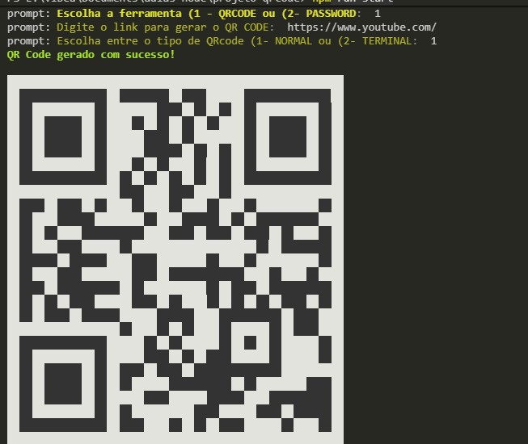

# 🔐 Gerador de Senhas & QR Code (Node.js)

Este projeto é uma ferramenta de linha de comando desenvolvida em Node.js para facilitar a rotina de segurança e conectividade. Ele permite gerar senhas aleatórias e seguras com critérios customizáveis e criar QR Codes a partir de links, tudo de forma modular e eficiente.

<p align="center">
  
</p>

## ✨ Funcionalidades

O projeto foi construído focando em modularidade e flexibilidade, oferecendo:

* **Gerador de Senhas Seguras:** Cria combinações aleatórias baseadas em variáveis de ambiente.
    * Suporte a letras maiúsculas, minúsculas, números e caracteres especiais.
    * Configuração de tamanho da senha via `.env`.
* **Gerador de QR Code:** Transforma links em imagens de QR Code diretamente no terminal.
* **Integração com Variáveis de Ambiente:** Utiliza o arquivo `.env` para definir as regras de geração, permitindo que cada usuário personalize o comportamento do software sem alterar o código principal.
* **Interface via Prompt:** Utiliza esquemas de validação para capturar as escolhas do usuário de forma interativa e amigável.
* **Modularização Clean Code:** Separação clara entre lógica de serviços, esquemas de entrada e utilitários.

## 🛠️ Tecnologias Utilizadas

* **Node.js:** Ambiente de execução Javascript server-side.
* **Prompt-sync / Prompt:** Para capturar entradas do usuário no terminal.
* **QRCode-Terminal:** Para renderização de códigos QR.
* **Dotenv:** Para gerenciamento de variáveis de configuração.
* **JavaScript (ES6+):** Lógica moderna com módulos e funções assíncronas.

## 🚀 Como Rodar o Projeto

Siga os passos abaixo para configurar e executar o projeto em sua máquina local.

### Pré-requisitos

Certifique-se de ter o [Node.js](https://nodejs.org/en/download/) instalado em seu sistema.

### Instalação

1.  **Clone o repositório:**
    ```bash
    git clone https://github.com/vitoriagiorgini/gerador-de-senhas-e-qrcode-node.git
    cd gerador-de-senhas-e-qrcode-node
    ```
2.  **Instale as dependências:**
    ```bash
    npm install
    ```

### Configuração

O projeto utiliza um arquivo `.env` para definir o comportamento da geração de senhas. **Importante:** Neste repositório, o `.env` foi mantido para servir de exemplo de configuração rápida para novos usuários.

### Execução

1.  **Inicie a aplicação:**
    ```bash
    npm run start
    ```
2.  Siga as instruções no terminal para escolher entre gerar um QR Code ou uma senha.

## 📂 Estrutura do Projeto

A organização das pastas segue o princípio de responsabilidade única:

```
PROJETO-QRCODE/
├── src/
│   ├── prompts-schema/    # Define a estrutura e validação dos menus de escolha
│   ├── services/          # Contém a lógica de negócio central
│   │   ├── password/      # Lógica de geração de senhas e utilitários de caracteres
│   │   ├── qr-code/       # Lógica de processamento e exibição de QR Codes
│   ├── index.js           # Ponto de entrada (Main) que orquestra o fluxo da aplicação
├── .env                   # Arquivo de configuração de variáveis de ambiente das senhas
├── package.json           # Gerenciamento de dependências e scripts
└── .gitignore             # Arquivos ignorados pelo controle de versão
```

